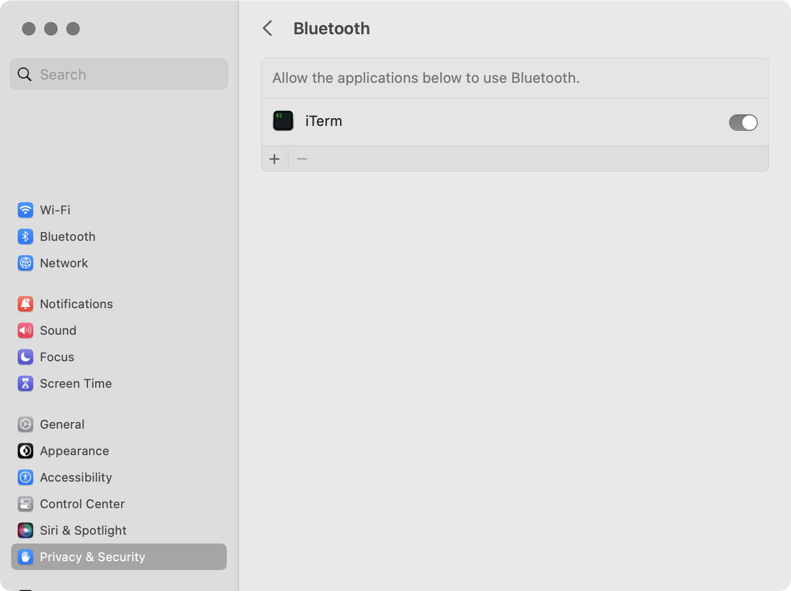

# Sendungsbewusstsein

see [DOCUMENTATION](./DOCUMENTATION.md) for usage information.

## build prerequisites

- install CMake with homebrew `brew install cmake`
- on macOS allow terminal application to use Bluetooth in `System Settings / Privacy & Security / Bluetooth` 



*example for macOS 13.4.1 and iTerm*

## build 

```
$ mkdir build
$ cd build
$ cmake ..
$ make
```

## libraries

this project uses the following libraries:

- [oscpack](https://github.com/RossBencina/oscpack)
- [SimpleBLE](https://github.com/OpenBluetoothToolbox/SimpleBLE)
- [cxxopts](https://github.com/jarro2783/cxxopts)
